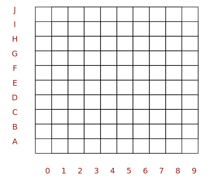
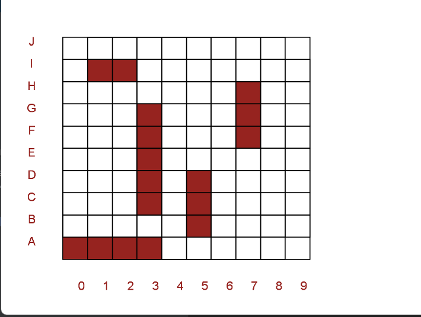
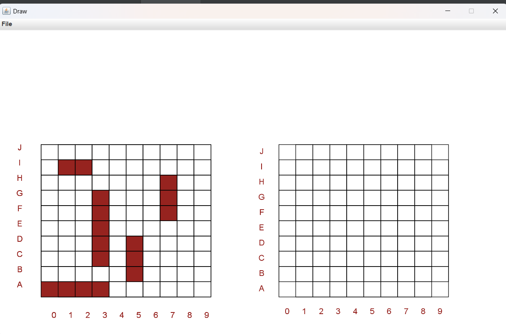

# Lista 2 - Programação Orientada a Objetos
por: Germano Dolwitsch Coelho

## INTRODUÇÃO

Este repositório é destinado à lista 2 da disciplina de POO (Programação Orientada a Objetos), onde a sua tarefa consiste
em trabalhar com a classe Draw em Java para criarmos uma ‘interface’ gráfica do jogo Batalha Naval.
 
A tarefa é dividida em 4 etapas cruciais para a realização da atividade na qual vamos verificar logo abaixo.
 

## ETAPA 1 - Dependência e inicialização da aplicação

Para começar a aplicação primeiramente temos que baixar o arquivo onde contem a classe Draw que será de suma importância para o projeto.

A sua Instalação pode ser encontrar aqui <a href="https://github.com/emersonmello/algs4/releases">algs.jar</a>.

Após a sua instalação, é necessário que você inclua o arquivo algs.jar numa pasta libs e adicionar esta pasta libs como dependência do projeto. 

Na classe App.java, deve-se importar a classe Draw para ser executavél na sua classe Main com o seguinte import <strong>import edu.princeton.cs.algs4.Draw;</strong>

Crie um método construtor da classe ‘App’ para inicializar com os seguintes valores padrão da tela de Draw. 
* Usar uma janela de dimensão 1000 × 600 pixels
* Usar uma escala de 0 a 1000 no eixo X da janela
* Usar uma escala de 0 a 600 no eixo Y da janela

E por fim, crie um objeto <strong>‘App’</strong> no método <strong>main</strong> onde ao executar a aplicação, deve-se criar uma janela Draw em branco com os valores atribuitos.
 
Segue os exemplos abaixo:

## ETAPA 2 - Modelando a classe Grade

Nesta etapa, será feita a modelagem da classe <strong> Grade </strong>, que como objetivo criar uma grade 10x10 no Draw.

Especificações:

* A classe Grade deve ter um método público chamado desenhar que recebe um objeto Draw como
argumento.
* O método desenhar deve usar o objeto Draw para desenhar uma grade 10 times 10 na tela.
* Cada célula da grade deve ter dimensão de 40 × 40 pixels.
* A grade deve ser desenhada com seu canto inferior esquerdo na posição (x, y) da tela. Os valores
de x e y devem ser informados durante a construção do objeto Grade.
* A grade deve ser desenhada com rótulos para as linhas e colunas.

Segue o exemplo abaixo:

## ETAPA 3 - Modelando a classe Navio

Nesta etapa, será feita a modelagem da classe <strong> Navio </strong>, que como objetivo criar os navios da batalha navio onde cada um terá seus tamanhos de posições.

| Navio           | Tamanho (casas) | Símbolo |
|-----------------|-----------------|---------|
| Porta-aviões    | 5               | P       |
| Encouraçado     | 4               | E       |
| Cruzador        | 3               | C       |
| Submarino       | 3               | S       |
| Contratorpedeiro| 2               | N       |

Especificações:

* A classe Navio deve ter um método público chamado desenhar que recebe um objeto Draw como
argumento.
* O método desenhar deve usar o objeto Draw para desenhar um navio na tela
* O objeto Navio deve ser construído com argumentos para definir à qual Grade ele pertence, seu
tamanho, posição (x, y) na grade e orientação (vertical ou horizontal)
* O Navio deve ser desenhado como uma série de quadrados coloridos. A dimensão dos quadrados é
igual ao tamanho da célula da Grade (40 × 40 pixels). A cor dos quadrados deve ser a mesma dos
rótulos da Grade.

Segue o exemplo abaixo: 

## ETAPA 4 - Criando o tabuleiro de batalha naval

Na última etapa, será feita a implementação final do jogo, onde o programa devera criar uma tela Draw contendo uma grade com os 5 navios e uma grade vazia.

Para esse fim:
* Crie duas grades e posicione elas em lados opostos da tela. A grade da esquerda representa o
tabuleiro do jogador, enquanto a grade da direita representará os alvos do jogador no tabuleiro inimigo.
* Crie cinco navios e posicione-os na grade a esquerda, representando os navios do jogador.

Para executar o programa, use o comando `./gradlew run` no terminal

O resultado final será a figura que segue abaxio:

